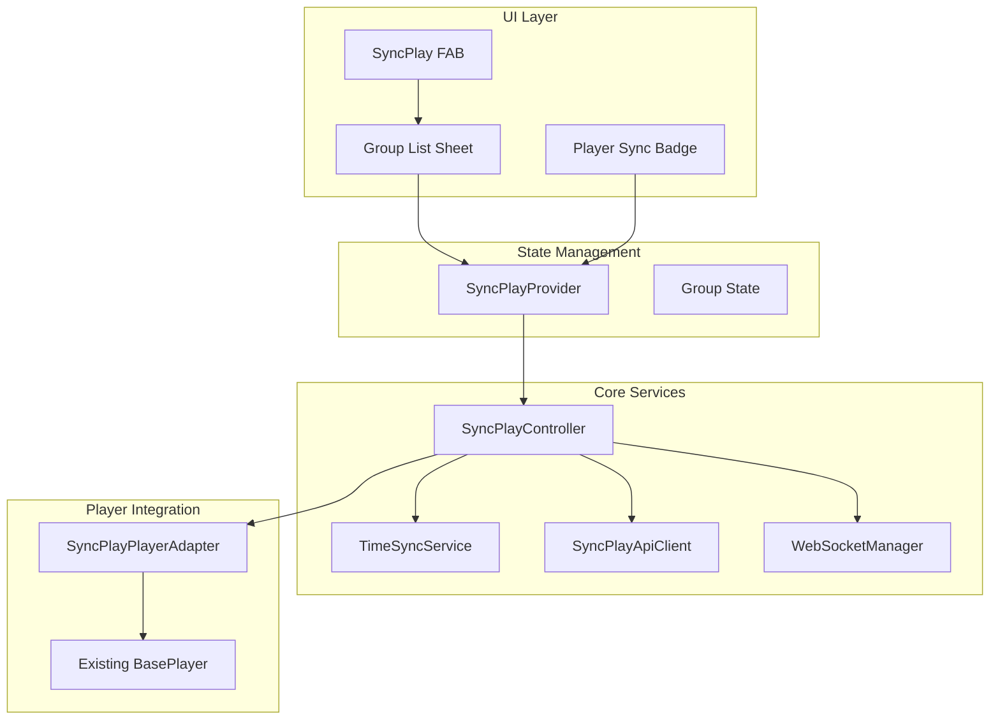
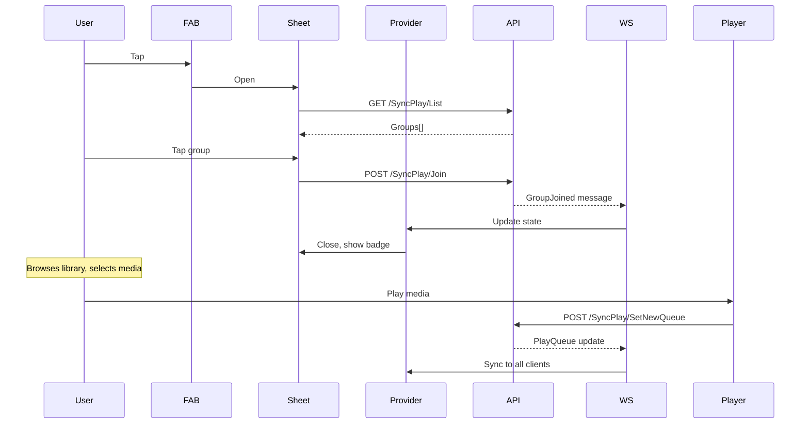

# SyncPlay MVP Implementation

## Architecture Overview

## Key Files to Create

| File | Purpose |

|------|---------|

| `lib/services/syncplay/websocket_manager.dart` | WebSocket connection, keep-alive, message routing |

| `lib/services/syncplay/time_sync_service.dart` | NTP-like clock offset calculation |

| `lib/services/syncplay/syncplay_controller.dart` | Command handling, state machine, scheduling |

| `lib/providers/syncplay_provider.dart` | Riverpod state management |

| `lib/widgets/syncplay/syncplay_fab.dart` | FAB widget for home screen |

| `lib/widgets/syncplay/syncplay_group_sheet.dart` | Bottom sheet for group list/create |

| `lib/widgets/syncplay/syncplay_badge.dart` | Badge indicator for player controls |

| `lib/wrappers/syncplay_player_adapter.dart` | Adapter bridging SyncPlay to `BasePlayer` |

## Existing Generated API (No Implementation Needed)

The Jellyfin client at `lib/jellyfin/jellyfin_open_api.swagger.dart` already provides:

**Endpoints:**

- `syncPlayListGet()`, `syncPlayNewPost()`, `syncPlayJoinPost()`, `syncPlayLeavePost()`
- `syncPlayPausePost()`, `syncPlayUnpausePost()`, `syncPlayStopPost()`
- `syncPlaySeekPost()`, `syncPlayBufferingPost()`, `syncPlayReadyPost()`, `syncPlayPingPost()`
- `syncPlaySetNewQueuePost()`, `getUtcTimeGet()`

**Models:**

- `GroupInfoDto`, `SyncPlayCommandMessage`, `SyncPlayGroupUpdateMessage`
- `BufferRequestDto`, `ReadyRequestDto`, `SeekRequestDto`, `PingRequestDto`
- `UtcTimeResponse`, `PlayQueueUpdate`, etc.

## Key Files to Modify

- [`lib/screens/home_screen.dart`](lib/screens/home_screen.dart) - Add SyncPlay FAB to dashboard destination
- [`lib/screens/video_player/video_player_controls.dart`](lib/screens/video_player/video_player_controls.dart) - Add sync badge, intercept user actions
- [`lib/wrappers/media_control_wrapper.dart`](lib/wrappers/media_control_wrapper.dart) - Hook SyncPlay adapter

## Implementation Details

### 1. WebSocket Manager

- Connect to `wss://{server}/socket?api_key={token}&deviceId={deviceId}`
- Handle `ForceKeepAlive` with half-interval pings
- Route `SyncPlayCommand` and `SyncPlayGroupUpdate` messages
- Auto-reconnect with exponential backoff

### 2. Time Sync Service

- Use `/GetUtcTime` endpoint with T1-T4 timestamps
- Calculate offset: `((T2 - T1) + (T3 - T4)) / 2`
- Store 8 measurements, use minimum delay
- Greedy polling (1s) for first 3 pings, then 60s intervals
- Provide `remoteDateToLocal()` / `localDateToRemote()` converters

### 3. SyncPlay Controller

- State machine: Idle -> Waiting -> Playing/Paused
- Command scheduling with `Timer` for future execution
- Duplicate command detection (When + Position + Command + PlaylistItemId)
- Player event interception (distinguish user vs SyncPlay actions)
- Uses existing generated API client methods directly (no new API wrapper needed)

### 4. Player Adapter

Bridge between SyncPlay and existing `BasePlayer` / `MediaControlsWrapper`:

class SyncPlayPlayerAdapter {

final BasePlayer player;

bool _syncPlayAction = false; // Flag to distinguish SyncPlay vs user actions

// Wrap play/pause/seek to set flag

Future<void> syncPlayPause() async {

_syncPlayAction = true;

await player.pause();

_syncPlayAction = false;

}

// Expose streams for buffering/ready detection

Stream<bool> get onBuffering => player.stateStream.map((s) => s.buffering);

}

### 5. UI Components

- **FAB**: Icon changes when in sync session (normal: people icon, active: sync icon with badge)
- **Group Sheet**: List of groups with avatars, tap to join, "Create Group" button with name input
- **Player Badge**: Small indicator in player controls showing sync active + group name

## Data Flow: Join Group and Play

## Out of Scope (Future)

- SpeedToSync / SkipToSync drift correction
- Playlist queue management UI
- Participant list display
- Chat functionality