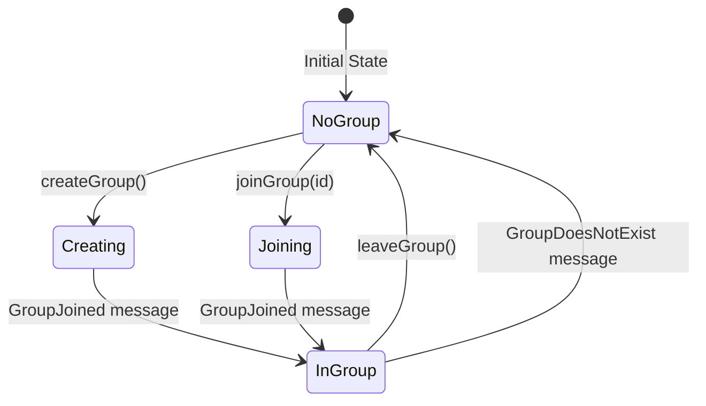
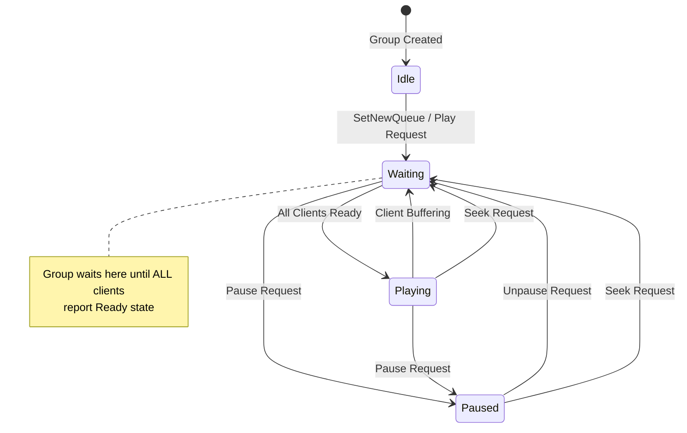
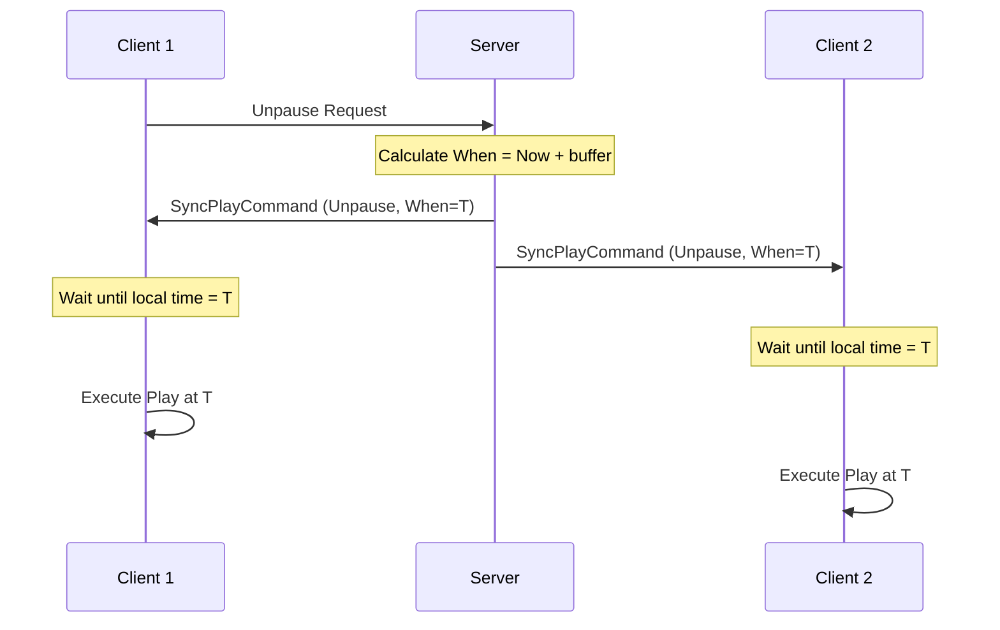
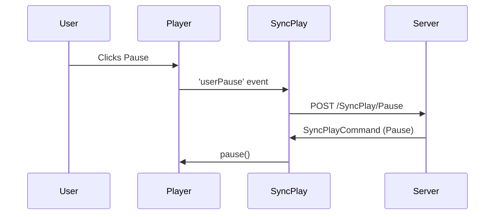
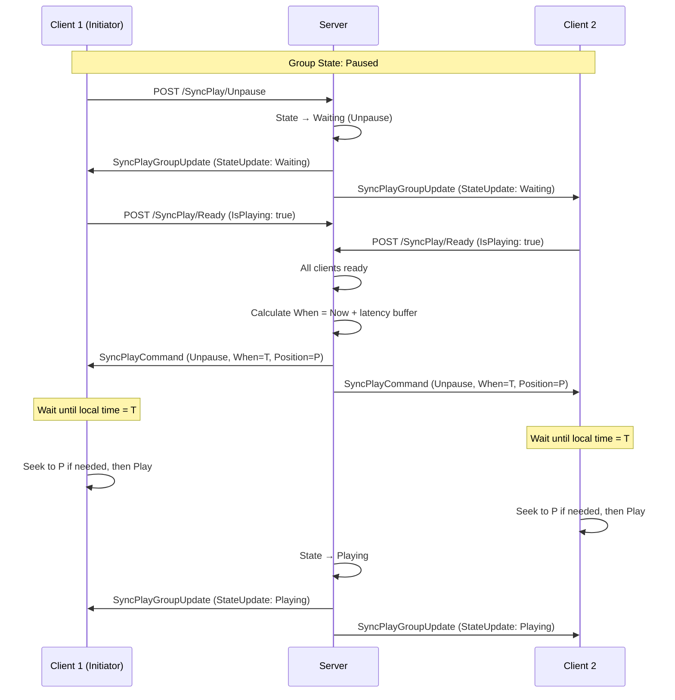
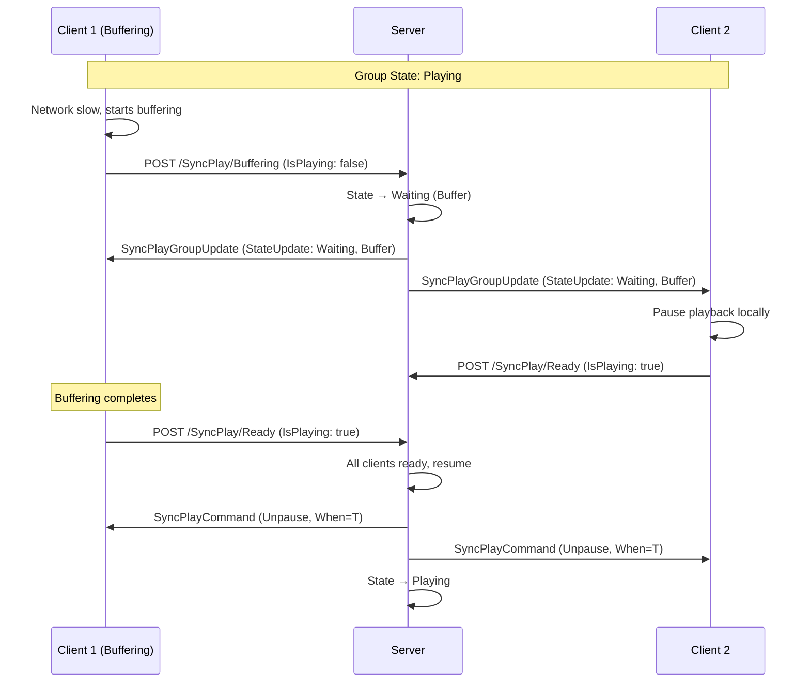
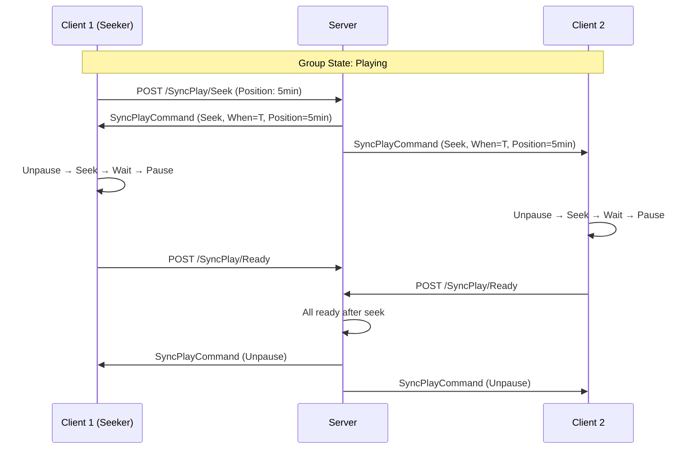

# SyncPlay Implementation Guide

A comprehensive technical specification for implementing Jellyfin SyncPlay synchronized playback in client applications.

## Table of Contents

1. [Overview](#overview)
2. [Architecture](#architecture)
3. [Communication Protocols](#communication-protocols)
4. [Time Synchronization](#time-synchronization)
5. [Group Management](#group-management)
6. [Playback Control](#playback-control)
7. [State Machine](#state-machine)
8. [Command Scheduling](#command-scheduling)
9. [Player Interface](#player-interface)
10. [Message Types Reference](#message-types-reference)
11. [Edge Cases & Error Handling](#edge-cases--error-handling)
12. [Implementation Checklist](#implementation-checklist)

---

## Overview

SyncPlay enables multiple clients to watch media together in perfect synchronization. The system coordinates playback across devices with different network latencies by:

1. Using a central server (Jellyfin) as the source of truth for group state
2. Synchronizing client clocks with the server via ping measurements
3. Scheduling playback commands to execute at precise server-defined timestamps
4. Managing a shared queue/playlist across all participants

### Key Principles

- **Server Authority**: The Jellyfin server owns the group state. Clients request changes, server broadcasts commands.
- **Time-based Coordination**: Commands include a `When` timestamp indicating exact execution time.
- **Buffering Awareness**: Clients report their buffering state; playback only resumes when ALL clients are ready.
- **Dual Protocol**: REST API for state-changing requests, WebSocket for real-time event delivery.

---

## Architecture

```
┌─────────────────────────────────────────────────────────────────────────────┐
│                              JELLYFIN SERVER                                │
│  ┌─────────────────┐    ┌─────────────────┐    ┌─────────────────────────┐  │
│  │   SyncPlay API  │    │  Group Manager  │    │  WebSocket Broadcaster  │  │
│  │   (REST)        │◄──►│  (State)        │◄──►│  (Events)               │  │
│  └─────────────────┘    └─────────────────┘    └─────────────────────────┘  │
└─────────────────────────────────────────────────────────────────────────────┘
         ▲                                                    │
         │ REST API                                           │ WebSocket
         │ (Requests)                                         │ (Commands/Updates)
         │                                                    ▼
┌─────────────────────────────────────────────────────────────────────────────┐
│                              CLIENT APPLICATION                             │
│  ┌─────────────────┐    ┌─────────────────┐    ┌─────────────────────────┐  │
│  │  REST Client    │    │  SyncPlay       │    │  WebSocket Manager      │  │
│  │  (Actions)      │◄──►│  Controller     │◄──►│  (Connection/Messages)  │  │
│  └─────────────────┘    └─────────────────┘    └─────────────────────────┘  │
│                                │                                            │
│                                ▼                                            │
│  ┌─────────────────┐    ┌─────────────────┐    ┌─────────────────────────┐  │
│  │  Time Sync      │    │  Command        │    │  Player Interface       │  │
│  │  (Clock Offset) │◄──►│  Handler        │◄──►│  (Video Control)        │  │
│  └─────────────────┘    └─────────────────┘    └─────────────────────────┘  │
└─────────────────────────────────────────────────────────────────────────────┘
```

### Component Responsibilities

| Component | Responsibility |
|-----------|----------------|
| **REST Client** | Sends state-change requests (pause, seek, ready, buffering) |
| **WebSocket Manager** | Maintains persistent connection, handles keep-alive, routes messages |
| **Time Sync** | Calculates clock offset between client and server |
| **Command Handler** | Schedules commands for future execution, handles duplicates |
| **Player Interface** | Abstraction layer between SyncPlay and actual video player |
| **SyncPlay Controller** | Orchestrates all components, manages group state |

---

## Communication Protocols

SyncPlay uses two complementary communication channels:

### REST API (Client → Server)

Used for **requesting** state changes. The server processes these and broadcasts commands to all clients.

| Endpoint | Purpose |
|----------|---------|
| `GET /SyncPlay/List` | List available groups |
| `POST /SyncPlay/New` | Create a new group |
| `POST /SyncPlay/Join` | Join an existing group |
| `POST /SyncPlay/Leave` | Leave current group |
| `POST /SyncPlay/Pause` | Request pause |
| `POST /SyncPlay/Unpause` | Request unpause/play |
| `POST /SyncPlay/Seek` | Request seek to position |
| `POST /SyncPlay/Stop` | Request stop |
| `POST /SyncPlay/Buffering` | Report buffering state |
| `POST /SyncPlay/Ready` | Report ready state |
| `POST /SyncPlay/SetNewQueue` | Set a new playlist |
| `POST /SyncPlay/Queue` | Add items to queue |
| `POST /SyncPlay/Ping` | Report ping measurement |
| `GET /GetUtcTime` | Get server timestamps for time sync (T2, T3) |

### WebSocket (Server → Client)

Used for **receiving** commands and state updates. Connect to:

```
wss://{server}/socket?api_key={token}&deviceId={deviceId}
```

Message types received:
- `SyncPlayCommand` - Playback control commands (pause, unpause, seek, stop)
- `SyncPlayGroupUpdate` - Group state changes (join, leave, playlist, state)
- `ForceKeepAlive` - Keep-alive configuration
- `KeepAlive` - Keep-alive acknowledgment

---

## Time Synchronization

**Critical for accurate synchronization.** Clients must maintain an accurate estimate of the offset between their local clock and the server's clock.

### Algorithm (NTP-like)

```
┌────────┐                              ┌────────┐
│ CLIENT │                              │ SERVER │
└────┬───┘                              └────┬───┘
     │                                       │
     │  requestSent (T1)                     │
     │──────────────────────────────────────►│
     │                                       │ requestReceived (T2)
     │                                       │
     │                                       │ responseSent (T3)
     │◄──────────────────────────────────────│
     │  responseReceived (T4)                │
     │                                       │
```

**Offset Calculation:**

```
offset = ((T2 - T1) + (T3 - T4)) / 2
```

**Round-trip Delay:**

```
delay = (T4 - T1) - (T3 - T2)
ping = delay / 2
```

### Server Time API

Jellyfin provides a dedicated endpoint for time synchronization that returns server-side timestamps:

**Endpoint:**
```http
GET /GetUtcTime
```

**Response:**
```json
{
    "RequestReceptionTime": "2024-01-15T12:00:00.0000000Z",
    "ResponseTransmissionTime": "2024-01-15T12:00:00.0010000Z"
}
```

| Field | Description |
|-------|-------------|
| `RequestReceptionTime` | When the server received the request (T2) |
| `ResponseTransmissionTime` | When the server sent the response (T3) |

The client records T1 (before sending) and T4 (after receiving) locally.

**Client-side Implementation:**

```typescript
async function requestPing(): Promise<{
    requestSent: Date;
    requestReceived: Date;
    responseSent: Date;
    responseReceived: Date;
}> {
    // T1: Record local time before request
    const requestSent = new Date();
    
    // Make request to Jellyfin TimeSync API
    const response = await fetch(`${serverUrl}/GetUtcTime`, {
        headers: { 'Authorization': `MediaBrowser Token="${accessToken}"` }
    });
    const data = await response.json();
    
    // T4: Record local time after response
    const responseReceived = new Date();
    
    // T2 and T3 come from server response
    const requestReceived = new Date(data.RequestReceptionTime);
    const responseSent = new Date(data.ResponseTransmissionTime);
    
    return {
        requestSent,       // T1 - local
        requestReceived,   // T2 - from server
        responseSent,      // T3 - from server
        responseReceived   // T4 - local
    };
}
```

**Flutter/Dart equivalent:**

```dart
Future<TimeSyncMeasurement> requestPing() async {
  // T1: Record local time before request
  final requestSent = DateTime.now().toUtc();
  
  // Make request to Jellyfin TimeSync API
  final response = await http.get(
    Uri.parse('$serverUrl/GetUtcTime'),
    headers: {'Authorization': 'MediaBrowser Token="$accessToken"'},
  );
  
  // T4: Record local time after response
  final responseReceived = DateTime.now().toUtc();
  
  final data = jsonDecode(response.body);
  
  // T2 and T3 from server
  final requestReceived = DateTime.parse(data['RequestReceptionTime']);
  final responseSent = DateTime.parse(data['ResponseTransmissionTime']);
  
  return TimeSyncMeasurement(
    requestSent: requestSent,
    requestReceived: requestReceived,
    responseSent: responseSent,
    responseReceived: responseReceived,
  );
}
```

### Implementation Details

```typescript
class Measurement {
    requestSent: number;      // T1 - when client sent request
    requestReceived: number;  // T2 - when server received request
    responseSent: number;     // T3 - when server sent response
    responseReceived: number; // T4 - when client received response

    getOffset(): number {
        return ((this.requestReceived - this.requestSent) + 
                (this.responseSent - this.responseReceived)) / 2;
    }

    getDelay(): number {
        return (this.responseReceived - this.requestSent) - 
               (this.responseSent - this.requestReceived);
    }

    getPing(): number {
        return this.getDelay() / 2;
    }
}
```

### Measurement Strategy

| Phase | Interval | Purpose |
|-------|----------|---------|
| **Greedy** (first 3 pings) | 1 second | Quick initial synchronization |
| **Low Profile** (subsequent) | 60 seconds | Maintain sync without network overhead |

**Best Measurement Selection:**
- Keep last 8 measurements
- Use measurement with **minimum delay** (least network jitter)

### Time Conversion Functions

```typescript
// Convert server time to local time
function remoteDateToLocal(serverTime: Date): Date {
    return new Date(serverTime.getTime() - offset);
}

// Convert local time to server time
function localDateToRemote(localTime: Date): Date {
    return new Date(localTime.getTime() + offset);
}
```

### Staleness Detection

Time sync becomes unreliable over time. Mark as stale after 30 seconds and force a refresh before critical operations.

```typescript
function isStale(): boolean {
    return (Date.now() - lastMeasurement.timestamp) > 30000;
}
```

---

## Group Management

### Group Lifecycle



### Create Group

**Request:**
```http
POST /SyncPlay/New
Content-Type: application/json

{
    "GroupName": "Movie Night"
}
```

**Response:** Group is created and you automatically join. Wait for `GroupJoined` WebSocket message.

### Join Group

**Request:**
```http
POST /SyncPlay/Join
Content-Type: application/json

{
    "GroupId": "abc-123-def"
}
```

### Leave Group

**Request:**
```http
POST /SyncPlay/Leave
```

### Group State Structure

```typescript
interface SyncPlayGroup {
    GroupId: string;
    GroupName: string;
    State: 'Idle' | 'Waiting' | 'Paused' | 'Playing';
    StateReason?: string;
    Participants: string[];
    PlayingItemId?: string;
    PositionTicks: number;
    IsPaused: boolean;  // derived: State === 'Paused' || State === 'Waiting'
}
```

---

## Playback Control

### Position Units

Jellyfin uses **ticks** for time positions:
- **1 tick = 100 nanoseconds**
- **10,000,000 ticks = 1 second**

```typescript
const TICKS_PER_SECOND = 10_000_000;

function secondsToTicks(seconds: number): number {
    return Math.floor(seconds * TICKS_PER_SECOND);
}

function ticksToSeconds(ticks: number): number {
    return ticks / TICKS_PER_SECOND;
}
```

### Pause Request

```http
POST /SyncPlay/Pause
```

No body required. Server broadcasts `Pause` command to all clients.

### Unpause Request

```http
POST /SyncPlay/Unpause
```

No body required. Server transitions group to `Waiting` state, waits for all clients to report ready, then broadcasts `Unpause` command.

### Seek Request

```http
POST /SyncPlay/Seek
Content-Type: application/json

{
    "PositionTicks": 300000000  // 30 seconds
}
```

### Ready State

Report when video is ready to play (buffering complete):

```http
POST /SyncPlay/Ready
Content-Type: application/json

{
    "When": "2024-01-15T12:00:00.000Z",
    "PositionTicks": 300000000,
    "IsPlaying": true,
    "PlaylistItemId": "playlist-item-uuid"
}
```

### Buffering State

Report when video starts buffering:

```http
POST /SyncPlay/Buffering
Content-Type: application/json

{
    "When": "2024-01-15T12:00:00.000Z",
    "PositionTicks": 300000000,
    "IsPlaying": false,
    "PlaylistItemId": "playlist-item-uuid"
}
```

### Ping Reporting

Report your measured ping to the server (helps with latency compensation):

```http
POST /SyncPlay/Ping
Content-Type: application/json

{
    "Ping": 45  // milliseconds, integer
}
```

---

## State Machine

### Group States



### State Definitions

| State | Description |
|-------|-------------|
| **Idle** | No media playing, group is empty or inactive |
| **Waiting** | Waiting for all clients to buffer and report ready |
| **Playing** | All clients are playing in sync |
| **Paused** | Playback paused for all clients |

### State Reasons

The `StateReason` field indicates why the group entered its current state:

| Reason | Meaning |
|--------|---------|
| `NewPlaylist` | A new queue was set |
| `SetCurrentItem` | Current item changed |
| `Unpause` | User requested unpause |
| `Pause` | User requested pause |
| `Seek` | User requested seek |
| `Buffer` | A client started buffering |
| `Ready` | All clients reported ready |

---

## Command Scheduling

Commands include a `When` timestamp indicating when they should execute. This is critical for synchronization.

### Command Flow



### Scheduling Algorithm

```typescript
async function scheduleCommand(command: SyncPlayCommand): Promise<void> {
    const serverTime = new Date(command.When);
    const localTime = new Date();
    
    // Convert server time to local time using time sync
    const commandTime = timeSync.remoteDateToLocal(serverTime);
    
    // Calculate delay
    let delay = commandTime.getTime() - localTime.getTime();
    
    if (delay < 0) {
        // Command is in the past - execute immediately
        executeCommand(command);
        return;
    }
    
    if (delay > 5000) {
        // Suspiciously large delay - might indicate time sync issue
        console.warn(`Large delay detected: ${delay}ms`);
        // Optionally force time sync update
    }
    
    // Schedule for future execution
    setTimeout(() => {
        executeCommand(command);
    }, delay);
}
```

### Command Execution Order

Different commands require different execution sequences:

#### Pause Command
1. Pause the player
2. Wait for pause to complete
3. Seek to position if provided (and significantly different from current)

#### Unpause Command
1. Seek to position if significantly different from current
2. Wait for seek to complete (video can play)
3. Start playback

#### Seek Command
1. Start playback (unpause)
2. Seek to target position
3. Wait for seek to complete
4. Pause the player
5. Send Ready state to server

```typescript
async function executeCommand(
    type: 'pause' | 'unpause' | 'seek' | 'stop',
    positionTicks?: number
): Promise<void> {
    const timeInSeconds = positionTicks ? ticksToSeconds(positionTicks) : 0;
    
    switch (type) {
        case 'pause':
            player.pause();
            await waitForPause();
            if (positionTicks && Math.abs(timeInSeconds - player.currentTime) > 0.5) {
                player.seek(timeInSeconds);
            }
            break;
            
        case 'unpause':
            if (positionTicks && Math.abs(timeInSeconds - player.currentTime) > 0.5) {
                player.seek(timeInSeconds);
                await player.waitForCanPlay();
            }
            player.play();
            break;
            
        case 'seek':
            player.play();
            player.seek(timeInSeconds);
            await player.waitForCanPlay();
            player.pause();
            sendReady(true, player.positionTicks);
            break;
            
        case 'stop':
            player.pause();
            player.seek(0);
            break;
    }
}
```

### Handling Late Commands (estimateCurrentTicks)

When a command's `When` timestamp is in the past (command arrived late), you must estimate where playback *should* be now:

```typescript
/**
 * Estimates current position given a past state.
 * @param ticks - Position at the time of the command
 * @param when - Server time when position was valid
 * @param currentTime - Current local time (optional)
 */
function estimateCurrentTicks(
    ticks: number, 
    when: Date, 
    currentTime: Date = new Date()
): number {
    const remoteTime = timeSync.localDateToRemote(currentTime);
    const elapsedMs = remoteTime.getTime() - when.getTime();
    return ticks + (elapsedMs * TICKS_PER_MILLISECOND);
}
```

**Usage in scheduleUnpause:**

```typescript
async function scheduleUnpause(playAtTime: Date, positionTicks: number): Promise<void> {
    const currentTime = new Date();
    const playAtTimeLocal = timeSync.remoteDateToLocal(playAtTime);
    
    if (playAtTimeLocal > currentTime) {
        // Future command - schedule it
        const delay = playAtTimeLocal.getTime() - currentTime.getTime();
        setTimeout(() => {
            player.play();
        }, delay);
    } else {
        // Late command - estimate where playback should be NOW
        const serverPositionTicks = estimateCurrentTicks(positionTicks, playAtTime);
        player.seek(ticksToSeconds(serverPositionTicks));
        player.play();
    }
}
```

### Playback Sync Correction (SpeedToSync / SkipToSync)

During playback, clients may drift out of sync. The official Jellyfin client implements two correction strategies:

#### Strategy 1: SpeedToSync

Adjusts playback rate temporarily to catch up without visible jumps:

```typescript
// Constants
const MIN_DELAY_SPEED_TO_SYNC = 60;      // ms - minimum delay to trigger
const MAX_DELAY_SPEED_TO_SYNC = 3000;    // ms - maximum delay (use SkipToSync above this)
const SPEED_TO_SYNC_DURATION = 1000;     // ms - how long to speed up

function syncPlaybackTime(currentPosition: number, currentTime: Date): void {
    if (!lastCommand || lastCommand.Command !== 'Unpause') return;
    
    const currentPositionTicks = currentPosition * TICKS_PER_MILLISECOND;
    const serverPositionTicks = estimateCurrentTicks(
        lastCommand.PositionTicks, 
        lastCommand.When, 
        currentTime
    );
    
    const diffMs = (serverPositionTicks - currentPositionTicks) / TICKS_PER_MILLISECOND;
    const absDiffMs = Math.abs(diffMs);
    
    if (absDiffMs >= MIN_DELAY_SPEED_TO_SYNC && absDiffMs < MAX_DELAY_SPEED_TO_SYNC) {
        // Calculate speed to catch up within SPEED_TO_SYNC_DURATION
        const speed = 1 + (diffMs / SPEED_TO_SYNC_DURATION);
        
        player.setPlaybackRate(speed);
        
        setTimeout(() => {
            player.setPlaybackRate(1.0);
        }, SPEED_TO_SYNC_DURATION);
    }
}
```

#### Strategy 2: SkipToSync

For larger delays, seek directly to the correct position:

```typescript
const MIN_DELAY_SKIP_TO_SYNC = 400;  // ms

if (absDiffMs >= MIN_DELAY_SKIP_TO_SYNC) {
    player.seek(ticksToSeconds(serverPositionTicks));
}
```

#### Sync Correction Flow

```
┌─────────────────────────────────────────────────────────────────────┐
│                    Playback Diff Detection                         │
├─────────────────────────────────────────────────────────────────────┤
│  Calculate: diffMs = serverPosition - clientPosition               │
├─────────────────────────────────────────────────────────────────────┤
│                                                                     │
│  if (|diffMs| < 60ms)                                               │
│      → In sync, do nothing                                          │
│                                                                     │
│  else if (60ms <= |diffMs| < 3000ms)                                │
│      → SpeedToSync: adjust playback rate                            │
│      → speed = 1 + (diffMs / 1000)                                  │
│      → Reset rate after 1 second                                    │
│                                                                     │
│  else if (|diffMs| >= 400ms && SpeedToSync not applicable)          │
│      → SkipToSync: seek to correct position                         │
│                                                                     │
└─────────────────────────────────────────────────────────────────────┘
```

#### When to Run Sync Correction

- Only when `syncEnabled` is true (after initial unpause settles)
- Only during active playback (`Command === 'Unpause'`)
- Throttle to avoid overloading (e.g., check every 500ms-1s)
- Disable during buffering

### Duplicate Command Detection

The server may send the same command multiple times (network retries, state synchronization). Track recent commands to avoid re-execution:

```typescript
interface LastCommand {
    when: string;
    positionTicks: number;
    command: string;
    playlistItemId: string;
}

function isDuplicate(command: SyncPlayCommand, lastCommand: LastCommand): boolean {
    return (
        lastCommand.when === command.When &&
        lastCommand.positionTicks === command.PositionTicks &&
        lastCommand.command === command.Command &&
        lastCommand.playlistItemId === command.PlaylistItemId
    );
}
```

---

## Player Interface

Define a clean abstraction between SyncPlay and your video player. This enables SyncPlay to control any player implementation.

### Interface Definition

```typescript
interface SyncPlayPlayerInterface {
    // State Queries
    getCurrentTime(): number;      // Current position in seconds
    getPositionTicks(): number;    // Current position in ticks
    isPaused(): boolean;           // Is player paused
    isReady(): boolean;            // Can video play (not buffering)
    isPlaying(): boolean;          // Is actively playing (not paused, not buffering)
    
    // Controls
    play(): void;
    pause(): void;
    seek(timeInSeconds: number): void;
    seekToTicks(positionTicks: number): void;
    
    // Playback Rate (for SpeedToSync)
    hasPlaybackRate(): boolean;           // Does player support playback rate?
    getPlaybackRate(): number;            // Current playback rate (1.0 = normal)
    setPlaybackRate(rate: number): void;  // Set playback rate
    
    // Event Handling
    on(event: PlayerEvent, handler: Function): void;
    off(event: PlayerEvent, handler: Function): void;
    once(event: PlayerEvent): Promise<void>;
}

type PlayerEvent = 
    | 'userPlay'      // User initiated play (not SyncPlay)
    | 'userPause'     // User initiated pause
    | 'userSeek'      // User initiated seek
    | 'videoCanPlay'  // Buffering complete, ready to play
    | 'videoBuffering'// Started buffering
    | 'videoSeeked'   // Seek operation complete
    | 'timeUpdate';   // Periodic position update (for sync correction)
```

**Dart/Flutter equivalent:**

```dart
abstract class SyncPlayPlayerInterface {
  // State Queries
  double getCurrentTime();        // seconds
  int getPositionTicks();         // ticks
  bool isPaused();
  bool isReady();
  bool isPlaying();
  
  // Controls
  void play();
  void pause();
  void seek(double timeInSeconds);
  void seekToTicks(int positionTicks);
  
  // Playback Rate (for SpeedToSync)
  bool hasPlaybackRate();
  double getPlaybackRate();
  void setPlaybackRate(double rate);
  
  // Event Streams
  Stream<void> get onUserPlay;
  Stream<void> get onUserPause;
  Stream<double> get onUserSeek;
  Stream<void> get onVideoCanPlay;
  Stream<void> get onVideoBuffering;
  Stream<double> get onTimeUpdate;
}
```

### Event Flow: User Actions

When a user interacts with the player directly (not through SyncPlay commands), the player should emit events:



### Distinguishing User vs SyncPlay Actions

You must differentiate between:
- **User actions**: Should trigger REST API requests to server
- **SyncPlay commands**: Should control player without triggering API requests

Common approaches:
1. Set a flag before executing SyncPlay commands, check it in event handlers
2. Use separate code paths for user controls vs SyncPlay controls
3. Temporarily unsubscribe from events during SyncPlay operations

---

## Message Types Reference

### SyncPlayCommand

```typescript
interface SyncPlayCommandMessage {
    MessageId: string;
    MessageType: 'SyncPlayCommand';
    Data: {
        GroupId: string;
        PlaylistItemId: string;
        When: string;           // ISO 8601 timestamp for execution
        PositionTicks: number;
        Command: 'Unpause' | 'Pause' | 'Seek' | 'Stop';
        EmittedAt: string;      // When server sent this command
    };
}
```

### SyncPlayGroupUpdate

```typescript
interface SyncPlayGroupUpdateMessage {
    MessageId: string;
    MessageType: 'SyncPlayGroupUpdate';
    Data: {
        GroupId: string;
        Type: 'GroupJoined' | 'UserJoined' | 'UserLeft' | 
              'PlayQueue' | 'StateUpdate' | 'GroupDoesNotExist';
        Data: GroupJoinedData | string | PlayQueueData | StateUpdateData;
    };
}
```

### GroupJoined Data

```typescript
interface GroupJoinedData {
    GroupId: string;
    GroupName: string;
    State: string;
    Participants: string[];
    LastUpdatedAt: string;
    PlayingItemId?: string;
    PositionTicks?: number;
}
```

### PlayQueue Data

```typescript
interface PlayQueueData {
    Reason: 'NewPlaylist' | 'SetCurrentItem' | 'Queue' | 'RemoveFromPlaylist';
    LastUpdate: string;
    Playlist: Array<{
        ItemId: string;
        PlaylistItemId: string;
    }>;
    PlayingItemIndex: number;
    StartPositionTicks: number;
    IsPlaying: boolean;
    ShuffleMode: string;
    RepeatMode: string;
}
```

### StateUpdate Data

```typescript
interface StateUpdateData {
    State: 'Idle' | 'Waiting' | 'Paused' | 'Playing';
    Reason: string;
    PositionTicks: number;
}
```

### ForceKeepAlive

```typescript
interface ForceKeepAliveMessage {
    MessageType: 'ForceKeepAlive';
    Data: number;  // Timeout in seconds
}
```

Handle by sending `KeepAlive` messages at half the timeout interval:

```typescript
function handleForceKeepAlive(timeout: number): void {
    const intervalMs = timeout * 1000 * 0.5;
    
    setInterval(() => {
        websocket.send(JSON.stringify({ MessageType: 'KeepAlive' }));
    }, intervalMs);
}
```

---

## Edge Cases & Error Handling

### Message Deduplication

WebSocket messages may be received multiple times. Track recent message IDs:

```typescript
const recentMessageIds: string[] = [];
const MAX_TRACKED_IDS = 10;

function handleMessage(message: any): void {
    const messageId = message.MessageId;
    
    if (messageId && recentMessageIds.includes(messageId)) {
        // Duplicate - ignore
        return;
    }
    
    if (messageId) {
        recentMessageIds.push(messageId);
        if (recentMessageIds.length > MAX_TRACKED_IDS) {
            recentMessageIds.shift();
        }
    }
    
    // Process message...
}
```

### Network Disconnection

When WebSocket disconnects:
1. Update connection status to `disconnected`
2. Clear keep-alive interval
3. Attempt reconnection with exponential backoff
4. On reconnect, the server will send current group state

### Group No Longer Exists

Handle `GroupDoesNotExist` message:

```typescript
function handleGroupDoesNotExist(): void {
    currentGroup = null;
    isEnabled = false;
    disconnect();
    showNotification('Group no longer exists');
}
```

### Stale Time Sync

Before executing critical commands, check if time sync is stale:

```typescript
async function executeTimeSensitiveCommand(command: Command): Promise<void> {
    if (timeSync.isStale()) {
        await timeSync.forceUpdateAndWait();
    }
    
    // Now safe to schedule command
    await scheduleCommand(command);
}
```

### Player Not Ready

When receiving commands before player is initialized:

```typescript
async function handleCommand(command: SyncPlayCommand): Promise<void> {
    if (!player) {
        console.warn('Command received but player not registered');
        return;
    }
    
    // If command requires ready state, wait for it
    if (!player.isReady()) {
        await player.once('videoCanPlay');
    }
    
    await executeCommand(command);
}
```

### State Transition: Waiting → Playing

When group transitions from `Waiting` to `Playing`, ensure your client is actually playing:

```typescript
function handleStateUpdate(previousState: string, newState: string): void {
    if (newState === 'Playing' && previousState === 'Waiting') {
        // Double-check player is playing
        if (player.isPaused()) {
            player.play();
        }
    }
}
```

### Handling Waiting State with Different Reasons

```typescript
async function handleWaitingState(reason: string, positionTicks: number): Promise<void> {
    switch (reason) {
        case 'Ready':
            // All clients ready - unpause will follow
            await requestUnpause();
            break;
            
        case 'Buffer':
            // Another client is buffering
            // Wait for our player to be ready, then report
            if (!player.isReady()) {
                await player.once('videoCanPlay');
            }
            await sendReady(true, positionTicks);
            break;
            
        case 'Unpause':
            // Unpause requested, waiting for all clients
            await sendReady(true, positionTicks);
            break;
            
        case 'Seek':
            // Seek was processed, now waiting
            // Ready state should be sent after seek command completes
            break;
    }
}
```

### Large Delay Detection

If calculated command delay is suspiciously large (>5 seconds), time sync may be off:

```typescript
async function scheduleWithValidation(command: SyncPlayCommand): Promise<void> {
    const delay = calculateDelay(command);
    
    if (delay > 5000) {
        // Force time sync update
        await timeSync.forceUpdateAndWait();
        
        // Recalculate delay
        const newDelay = calculateDelay(command);
        
        if (newDelay > 5000) {
            // Still too large - log warning but proceed
            console.warn(`Executing command with large delay: ${newDelay}ms`);
        }
    }
    
    // Continue with scheduling...
}
```

---

## Implementation Checklist

Use this checklist when implementing SyncPlay in a new client:

### Core Infrastructure

- [ ] WebSocket connection manager with auto-reconnect
- [ ] Keep-alive message handling
- [ ] REST API client for all SyncPlay endpoints
- [ ] Message routing by type

### Time Synchronization

- [ ] Implement `GET /GetUtcTime` API call
- [ ] Record T1 (local) before request, T4 (local) after response
- [ ] Parse T2 (`RequestReceptionTime`) and T3 (`ResponseTransmissionTime`) from server
- [ ] Offset calculation using NTP-like algorithm
- [ ] Storage of last N measurements (recommend 8)
- [ ] Best measurement selection (minimum delay)
- [ ] Greedy → low-profile polling transition
- [ ] Staleness detection (>30s)
- [ ] Force update capability
- [ ] Local ↔ remote time conversion

### Group Management

- [ ] Create group
- [ ] List available groups
- [ ] Join group
- [ ] Leave group
- [ ] Handle GroupJoined message
- [ ] Handle UserJoined/UserLeft messages
- [ ] Handle GroupDoesNotExist message
- [ ] Track current group state

### Playback Control

- [ ] Send pause request
- [ ] Send unpause request
- [ ] Send seek request
- [ ] Send stop request
- [ ] Send buffering state
- [ ] Send ready state
- [ ] Send ping measurements
- [ ] Set new queue
- [ ] Queue additional items

### Command Processing

- [ ] Parse SyncPlayCommand messages
- [ ] Convert server time to local time
- [ ] Calculate execution delay
- [ ] Schedule commands for future execution
- [ ] Execute immediately if delay < 0 with `estimateCurrentTicks()`
- [ ] Handle large delay warnings
- [ ] Duplicate command detection
- [ ] Command-specific execution sequences (pause, unpause, seek, stop)

### Sync Correction (Optional but Recommended)

- [ ] Implement `estimateCurrentTicks()` for late command handling
- [ ] Track playback diff during playback
- [ ] Implement SpeedToSync (playback rate adjustment)
- [ ] Implement SkipToSync (seek to correct position)
- [ ] Throttle sync checks (every 500ms-1s)
- [ ] Disable sync during buffering

### Player Integration

- [ ] Define player interface abstraction
- [ ] Register player with SyncPlay controller
- [ ] Subscribe to player events
- [ ] Distinguish user actions from SyncPlay commands
- [ ] Handle videoCanPlay event → send ready
- [ ] Handle videoBuffering event → send buffering
- [ ] Implement once() for async event waiting
- [ ] Support playback rate control (for SpeedToSync)
- [ ] Implement timeUpdate event (for sync correction)

### State Management

- [ ] Track group state (Idle, Waiting, Paused, Playing)
- [ ] Track state reason
- [ ] Track current playlist
- [ ] Track current playing item ID
- [ ] Track position in ticks
- [ ] Handle StateUpdate messages
- [ ] Handle PlayQueue messages

### Error Handling

- [ ] Message deduplication
- [ ] WebSocket disconnection recovery
- [ ] Stale time sync detection
- [ ] Player not ready handling
- [ ] API error handling with user feedback

---

## Appendix: Sequence Diagrams

### Full Unpause Flow



### Client Buffering During Playback



### Seek Operation



---

## Appendix: Validation Against Official Jellyfin Web Client

This documentation was validated against the [official Jellyfin web client](https://github.com/jellyfin/jellyfin-web/tree/master/src/plugins/syncPlay) (as of January 2025).

### ✅ Correctly Documented

| Component | Source File | Status |
|-----------|-------------|--------|
| Time Sync Algorithm | `TimeSync.js` | ✅ Same constants and algorithm |
| Server Time API | `TimeSyncServer.js` | ✅ Uses `getServerTime()` → same endpoint |
| Offset Calculation | `TimeSync.js` | ✅ `((T2-T1) + (T3-T4)) / 2` |
| Measurement Selection | `TimeSync.js` | ✅ Picks minimum delay |
| Polling Strategy | `TimeSync.js` | ✅ 1s greedy (3x), then 60s |
| Command Scheduling | `PlaybackCore.js` | ✅ setTimeout with time conversion |
| Pause Sequence | `PlaybackCore.js` | ✅ Pause → wait → seek |
| Unpause Sequence | `PlaybackCore.js` | ✅ Seek → wait → play (or estimate if late) |
| Seek Sequence | `PlaybackCore.js` | ✅ Play → seek → wait ready → pause → send ready |
| Duplicate Detection | `PlaybackCore.js` | ✅ Same 4-field comparison |
| Buffering/Ready | `PlaybackCore.js` | ✅ Same payload structure |
| Queue Management | `QueueCore.js` | ✅ Same reason handling |
| Player Interface | `GenericPlayer.js` | ✅ Same abstraction pattern |
| WebSocket Keep-Alive | External | ✅ Half-timeout interval |

### ⚠️ Advanced Features (Optional)

These features are in the official client but may be omitted for simpler implementations:

| Feature | Source File | Notes |
|---------|-------------|-------|
| SpeedToSync | `PlaybackCore.js` | Adjusts playback rate to catch up |
| SkipToSync | `PlaybackCore.js` | Seeks to correct position for large drifts |
| estimateCurrentTicks | `PlaybackCore.js` | Estimates position for late commands |
| extraTimeOffset | `TimeSyncCore.js` | Manual time offset adjustment setting |
| Repeat/Shuffle Mode | `QueueCore.js` | Queue mode synchronization |
| Player Factory | `PlayerFactory.js` | Multiple player type support |

### Key Differences from Official Client

1. **Sync Correction**: Official client continuously monitors playback position and corrects drift using SpeedToSync (60-3000ms drift) or SkipToSync (>400ms drift).

2. **Late Command Handling**: Official client uses `estimateCurrentTicks()` to calculate where playback *should* be when a command arrives after its scheduled time.

3. **Event Waiting**: Official uses `waitForEventOnce()` with timeout and reject events for robust async handling.

4. **Settings**: Official has configurable thresholds (`minDelaySpeedToSync`, `maxDelaySpeedToSync`, `speedToSyncDuration`, etc.).

---

## References

- [Jellyfin SyncPlay API Documentation](https://api.jellyfin.org/#tag/SyncPlay)
- [Jellyfin Web Client SyncPlay Implementation](https://github.com/jellyfin/jellyfin-web/tree/master/src/plugins/syncPlay)
- [Jellyfin Web Client Source - PlaybackCore.js](https://raw.githubusercontent.com/jellyfin/jellyfin-web/master/src/plugins/syncPlay/core/PlaybackCore.js)
- [Jellyfin Web Client Source - TimeSync.js](https://raw.githubusercontent.com/jellyfin/jellyfin-web/master/src/plugins/syncPlay/core/timeSync/TimeSync.js)
- [NTP Clock Synchronization Algorithm](https://en.wikipedia.org/wiki/Network_Time_Protocol#Clock_synchronization_algorithm)
